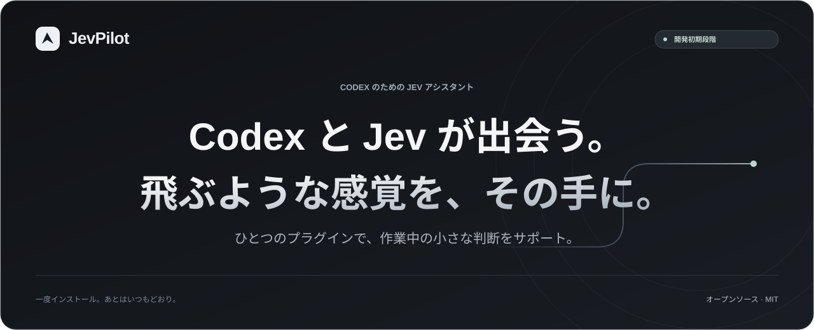

  
  
  

<a href="README.md">English</a> · <a href="README.zh-CN.md">简体中文</a> · <a href="README.ru.md">Русский</a> · <strong>日本語</strong> · <a href="README.ko.md">한국어</a>

# JevPilot

**いつもの Codex に、ひとつのプラグイン。**

実行可能な開発プレビューです。14 モジュールをひとつの MCP、ひとつの自動呼び出し Skill、デスクトップアダプターに統合しました。計画・実装・検証は Codex が、範囲の限られた判断は Jev が担当します。

## 全 14 機能

| # | 機能 | 役割 |
| :--- | :--- | :--- |
| 1 | **自動判断** | 候補が明確な判断をまとめて処理し、キャッシュと Codex へのフォールバックに対応。 |
| 2 | **推論強度の自動調整** | 選択モデルを維持し、実際のリクエストの強度を変更して適用結果を記録。 |
| 3 | **検索・ファイル選別** | 出典付きの候補を関連度で選び、省略範囲も表示。 |
| 4 | **復元可能な出力フィルター** | 長い出力の要点を残し、原文を保存して再読可能に。 |
| 5 | **ツール・Skill 選択** | 適切な候補を絞り、必須・不確実な候補を維持。 |
| 6 | **失敗分析と復旧** | 観測したエラーを分類し、効果のない再試行を防止。 |
| 7 | **完了証拠と品質確認** | 実行結果、出典の鮮度、内容ルール、翻訳の整合性を確認。 |
| 8 | **Chrome・Computer Use 連携** | 既存プラグインと連携し、最新の画面状態と一度限りの操作票で実行後も検証。 |
| 9 | **プロジェクト記憶** | 同意に基づき、出典・期限・矛盾・撤回を管理。 |
| 10 | **実測統計** | Jev の負荷、実行環境の使用量、実際の強度変更を別々に記録。 |
| 11 | **コンテキストの圧縮と引き継ぎ** | 制約と未完了作業を保持し、復元可能な引き継ぎを作成。 |
| 12 | **変更レビューとテスト選択** | 必須テストを省略せず、確認すべき変更を優先。 |
| 13 | **チェックポイントと再開** | 進捗を保存し、再開前にファイル変更を検証。 |
| 14 | **原文からの正確な抽出** | 原文の範囲と位置を返し、不明・曖昧な項目を明示。 |

## 対応状況と使い方

このプレビューには Node 24+、curl、rg が必要です。プラグインを一度導入し、自分の TypeSafe Key をローカルで設定して、セットアップを Codex に任せます。普段の作業に専用の起動や合言葉は不要です。[利用ガイド](docs/FEATURES.md)を参照してください。

共通テストは macOS・Windows・Linux で成功しました。macOS の実際の Codex エンジンと Computer Use を検証済みです。Windows/Linux のデスクトップは実機検証が残っています。実際の Chrome 拡張で、TUN を無効にした状態で Jev の判断、1 回の操作、ページの確認に成功しました。プロキシ継承はプラグイン設定のみで修復し、Codex 本体は変更しません。署名済みの公開インストーラーは未公開です。

## 検証と制約

コンテキストの引き継ぎはネイティブ履歴を書き換えず、消費済みトークンを回収しません。速度・トークン・利用枠の一律の節約率は約束しません。[検証報告](docs/reports/ACCEPTANCE.md)、[機能の境界](docs/FEATURES.md)、[今後の計画](docs/ROADMAP.md)をご覧ください。

主モデルはユーザーが選んだモデルを維持し、小さいモデルへの自動置換は有効にしていません。[モデル維持方針](docs/MODEL-PRESERVATION.md)をご覧ください。最新の[同一条件での推論強度比較](docs/reports/matched-routing-20260924/README.zh-CN.md)は4回試行し、3回合格、1回は制限時間に到達。ルーティングの利益は未確認です。[固定モデルでの委譲比較](docs/reports/delegation-ab-20260924/README.zh-CN.md)は4/4合格。Jevを含む既知の総トークンは −9.74%、時間は +12.60%、GPTの非キャッシュ入力は +43.77%でした。コンポーネント試験のため、デスクトップの高速化や利用枠の節約を示すものではありません。新しいレポートは中国語です。[以前の比較](docs/reports/factorial-20260924/README.md)も残しています。

追加の[証拠の選別・引き渡し最適化レポート（英語）](docs/reports/evidence-handoff-20260924/README.md)：コンポーネント試験4回すべて合格、平均選別時間 −50.17%、Jevトークン数は同じでした。Codexタスク全体の高速化を示すものではありません。網羅範囲の説明、原文の部分的な再取得、出力の簡素化を実装しました。

JevPilot は [MIT ライセンス](LICENSE)で公開しています。OpenAI や TypeSafe の公式製品ではない独立したコミュニティプロジェクトです。

機能再検証：[v15 の修正とトークン内訳（中国語）](docs/reports/functional-audit-20260923/README.zh-CN.md)。新しいタスクやエラーの再評価を妨げる休止を撤回し、呼び出し上限を維持しました。全体の高速化・削減は未確認です。
