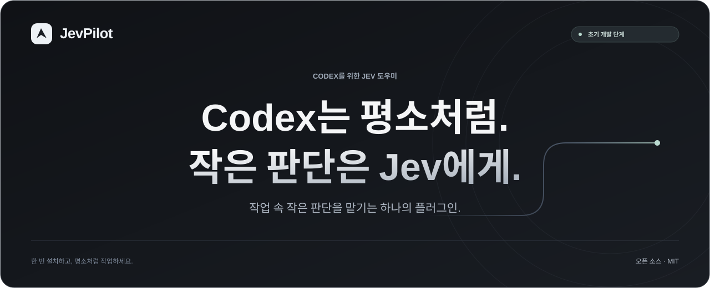

  
  
  

<a href="README.md">English</a> · <a href="README.zh-CN.md">简体中文</a> · <a href="README.ru.md">Русский</a> · <a href="README.ja.md">日本語</a> · <strong>한국어</strong>

<a href="#workflow">작동 방식</a> · <a href="#capabilities">기능</a> · <a href="docs/ROADMAP.md">로드맵</a> · <a href="https://github.com/wangzhezbz/jev-pilot/releases">릴리스</a> · <a href="LICENSE">MIT 라이선스</a>

# JevPilot

**Jev 플러그인 하나로, Codex는 평소처럼.**

JevPilot은 추론 강도 선택, 필요한 컨텍스트 선별, 실패한 단계의 복구 지원을 하나의 Codex 플러그인에 통합하는 프로젝트입니다. 한 번 설치하고 TypeSafe 계정을 연결하면 같은 대화에서 계속 작업할 수 있도록 만드는 것이 목표입니다.

**현재 초기 개발 단계입니다.** 이 저장소에는 프로젝트 소개와 개발 로드맵이 있습니다. 공개 설치 파일이나 실행 가능한 플러그인은 아직 없습니다. 아래 기능은 앞으로 구현할 제품 목표입니다.

## 작동 방식

사용자가 작업을 설명하면 Codex가 계획, 구현, 최종 검증을 맡습니다. Jev는 그 과정에서 범위가 명확한 작은 판단을 처리합니다.

예를 들어 버그를 조사할 때 JevPilot이 유용한 검색 결과와 로그 구간을 골라내고, 일시적인 네트워크 장애와 코드 오류를 구분하도록 도울 예정입니다. 근거를 읽고 코드를 수정하며 결과를 검증하는 역할은 계속 Codex가 담당합니다.

## 구현 예정 기능

| 기능 | 목적 |
| :--- | :--- |
| **추론 강도 자동 조정** | 현재 단계에 맞는 강도를 선택하고 실행 환경에서 실제로 적용되었는지 기록합니다. |
| **관련 컨텍스트 선별** | 검색 결과와 후보 파일의 우선순위를 정한 뒤 자세히 읽습니다. |
| **원문을 보존하는 필터링** | 긴 도구 출력을 줄이되 필요할 때 원본을 다시 읽을 수 있도록 합니다. |
| **실패 복구 지원** | 실패 유형을 분류하고 효과 없는 작업을 반복하지 않도록 돕습니다. |
| **완료 근거 확인** | 완료했다는 설명을 작업에 필요한 검사와 기록된 결과에 대조합니다. |
| **브라우저 작업 지원** | 범위가 정해진 브라우저 작업을 수행한 뒤 Codex에 제어권을 돌려주어 검증하게 합니다. |
| **실제 동작과 효과 표시** | 실제 Jev 호출, 적용된 변경, 지연 시간, 확인 가능한 토큰 사용량을 표시합니다. |

이 모듈들은 하나의 설치 경로를 통해 순차적으로 제공할 예정입니다. 사용자가 여러 스킬을 관리하거나 작업마다 특별한 호출 문구를 외울 필요가 없도록 설계합니다.

## 플랫폼과 다운로드

| 대상 플랫폼 | 공개 패키지 | 통합 상태 |
| :--- | :--- | :--- |
| Windows | 미출시 | 계획 단계, 검증 대기 |
| macOS | 미출시 | 계획 단계, 검증 대기 |
| Linux | 미출시 | 계획 단계, 검증 대기 |

세 플랫폼 모두 지원하는 것이 목표입니다. 실제 호환성은 운영체제, Codex 클라이언트, 버전별로 테스트한 뒤 공개합니다. 플랫폼 카드가 모든 운영체제에서 데스크톱 클라이언트를 현재 사용할 수 있다는 뜻은 아닙니다. 검증된 패키지가 나오기 전까지 카드는 이 항목으로 연결됩니다.

빌드가 준비되면 다운로드와 검증된 호환성 정보를 [Releases](https://github.com/wangzhezbz/jev-pilot/releases)에 게시합니다. 지금 실행할 설치 명령은 없습니다.

## 효과 측정

- **시간:** 분기 판단 비용과 재시도를 포함한 전체 작업 소요 시간.
- **사용량:** 확인 가능한 입력, 캐시 입력, 출력, 추론 토큰 수. Jev 사용량은 별도로 기록합니다.
- **품질:** 작업의 완료 기준 충족 여부, 근거 누락, 원문 재조회, 재작업.
- **실제 동작:** 권장 설정과 실행 환경에서 적용이 확인된 변경을 구분하여 기록합니다.

추론 강도를 낮추거나 도구 출력을 줄였다는 사실만으로 작업이 빨라지거나 계정 사용량이 줄었다고 볼 수는 없습니다. 모든 작업에 통하는 절감률을 약속하는 대신, 작업 조건과 측정 방법을 함께 공개하겠습니다.

## 개발

첫 단계에서는 공통 코어, 플랫폼별 어댑터, 통합 설정 절차, 진단 기능, 일반 Codex 동작으로 안전하게 돌아갈 수 있는 대체 경로를 준비합니다. 이후 검색 결과 선별과 실패 복구 지원을 추가하고, 다음으로 브라우저 작업 지원을 구현할 예정입니다.

[개발 단계와 완료 기준](docs/ROADMAP.md)은 영어와 중국어로 제공됩니다. 테스트하고 싶은 구체적인 작업이 있다면 작업 내용, 운영체제, Codex 버전을 적어 [Issue](https://github.com/wangzhezbz/jev-pilot/issues/new)를 열어 주세요. API 키나 비공개 로그는 포함하지 마세요.

## 라이선스와 출처

JevPilot의 자체 코드와 시각 자료는 [MIT 라이선스](LICENSE)로 제공됩니다. 외부 코드를 통합할 때는 해당 라이선스와 저작자 표시를 유지합니다. [외부 구성 요소 고지](docs/THIRD_PARTY_NOTICES.md)를 참고하세요.

JevPilot은 독립적인 커뮤니티 프로젝트이며 OpenAI 또는 TypeSafe의 공식 제품이 아닙니다. Jev는 [TypeSafe](https://typesafe.ai/)에서 제공합니다.
