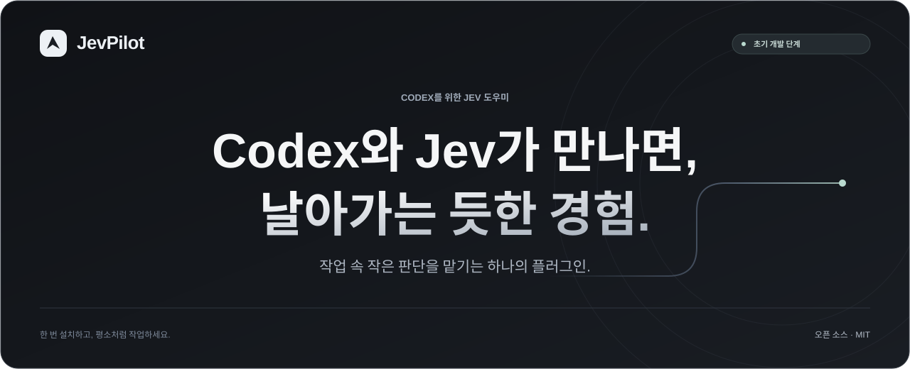

  
  
  

<a href="README.md">English</a> · <a href="README.zh-CN.md">简体中文</a> · <a href="README.ru.md">Русский</a> · <a href="README.ja.md">日本語</a> · <strong>한국어</strong>

# JevPilot

**평소 Codex 작업에 플러그인 하나면 됩니다.**

실행 가능한 개발 미리보기입니다. 14개 모듈이 하나의 MCP, 자동 호출 Skill 하나, 데스크톱 어댑터를 공유합니다. Codex는 계획·구현·검증을 담당하고 Jev는 범위가 명확한 판단을 맡습니다.

## 전체 14개 기능

| # | 기능 | 역할 |
| :--- | :--- | :--- |
| 1 | **자동 판단** | 후보가 명확한 판단을 묶어서 처리하고 캐시와 Codex 복귀를 지원합니다. |
| 2 | **추론 강도 자동 조절** | 선택한 모델을 유지하며 실제 요청의 강도를 변경하고 적용 결과를 기록합니다. |
| 3 | **검색 및 파일 선별** | 출처가 있는 후보를 관련성으로 선별하고 누락 범위를 표시합니다. |
| 4 | **복원 가능한 출력 필터** | 긴 출력의 핵심을 남기고 원문을 저장해 다시 읽을 수 있습니다. |
| 5 | **도구 및 Skill 선택** | 필수 후보와 불확실한 후보를 유지하면서 적합한 도구를 선택합니다. |
| 6 | **실패 분석 및 복구** | 관측한 오류를 분류하고 효과 없는 반복 시도를 방지합니다. |
| 7 | **완료 증거 및 품질 확인** | 실행 결과, 출처의 최신 상태, 콘텐츠 규칙과 번역을 확인합니다. |
| 8 | **Chrome 및 Computer Use 연동** | 기존 플러그인으로 최신 화면을 확인하고 일회용 작업 티켓으로 실행 후 검증합니다. |
| 9 | **프로젝트 메모리** | 동의 후 출처, 유효 기간, 충돌 및 철회를 관리합니다. |
| 10 | **실제 사용량 통계** | Jev 비용 요소, 런타임 사용량과 실제 강도 변경을 구분합니다. |
| 11 | **컨텍스트 압축 및 인계** | 제약과 미완료 작업을 보존하고 복원 가능한 인계 자료를 만듭니다. |
| 12 | **변경 검토 및 테스트 선택** | 필수 검사를 유지하며 변경 사항과 테스트의 우선순위를 정합니다. |
| 13 | **체크포인트 및 재개** | 진행 상황을 저장하고 재개 전에 파일 변경을 확인합니다. |
| 14 | **원문 정확 추출** | 원문 범위와 위치를 반환하고 누락되거나 모호한 필드를 표시합니다. |

## 플랫폼 및 사용 방법

이 미리보기에는 Node 24+, curl, rg가 필요합니다. 플러그인을 한 번 설치하고 개인 TypeSafe Key를 로컬에서 설정한 뒤 Codex가 설정을 처리하게 하면 됩니다. 일상 작업에는 별도 실행이나 호출 문구가 필요 없습니다. [사용 안내](docs/FEATURES.md)를 참고하세요.

공통 테스트는 macOS, Windows, Linux에서 통과했습니다. macOS의 실제 Codex 엔진과 Computer Use를 검증했습니다. Windows/Linux 데스크톱 세션은 실기기 검증이 남아 있습니다. 실제 Chrome 확장에서 TUN을 끈 상태로 Jev 판단, 단일 실행, 페이지 확인을 통과했습니다. 프록시 상속은 플러그인 설정만 수정하며 Codex 본체는 변경하지 않습니다. 공개 서명 설치 프로그램은 아직 없습니다.

## 검증 및 한계

컨텍스트 인계는 원래 대화 기록을 바꾸거나 이미 사용한 토큰을 회수하지 않습니다. 일정한 속도·토큰·사용 한도 절약률을 보장하지 않습니다. [검증 보고서](docs/reports/ACCEPTANCE.md), [기능 범위](docs/FEATURES.md), [로드맵](docs/ROADMAP.md)을 참고하세요.

JevPilot은 [MIT 라이선스](LICENSE)로 배포됩니다. OpenAI 또는 TypeSafe의 공식 제품이 아닌 독립 커뮤니티 프로젝트입니다.
