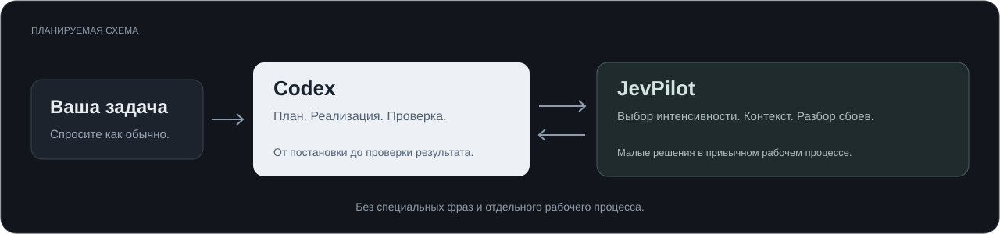

  
  
  

<a href="README.md">English</a> · <a href="README.zh-CN.md">简体中文</a> · <strong>Русский</strong> · <a href="README.ja.md">日本語</a> · <a href="README.ko.md">한국어</a>

<a href="#workflow">Как это работает</a> · <a href="#capabilities">Возможности</a> · <a href="docs/ROADMAP.md">План разработки</a> · <a href="https://github.com/wangzhezbz/jev-pilot/releases">Релизы</a> · <a href="LICENSE">Лицензия MIT</a>

# JevPilot

**Один плагин Jev. Привычная работа в Codex.**

JevPilot объединяет помощь Jev в одном плагине для Codex: выбор интенсивности рассуждений, отбор полезного контекста и восстановление после неудачных шагов. Цель — установить плагин один раз, подключить учётную запись TypeSafe и продолжать работу в том же диалоге.

**Ранняя стадия разработки:** сейчас репозиторий содержит описание проекта и план разработки. Общедоступного установщика и работающего плагина пока нет. Ниже описаны возможности, которые мы планируем реализовать.

## Как это работает

Вы описываете задачу. Codex отвечает за планирование, реализацию и итоговую проверку. Jev по ходу работы принимает небольшие решения в чётко заданных рамках.

Например, при поиске ошибки JevPilot должен отбирать полезные результаты поиска и фрагменты журналов, а также помогать отличать временный сетевой сбой от ошибки в коде. Codex по-прежнему изучает факты, вносит изменения и проверяет результат.

## Планируемые возможности

| Возможность | Назначение |
| :--- | :--- |
| **Адаптивные рассуждения** | Выбирать интенсивность для текущего шага и сообщать, действительно ли среда выполнения применила её. |
| **Полезный контекст** | Ранжировать результаты поиска и подходящие файлы перед подробным чтением. |
| **Фильтрация с доступом к оригиналу** | Сокращать большие результаты инструментов, сохраняя возможность повторно открыть исходные данные. |
| **Восстановление после сбоев** | Классифицировать ошибки и помогать избегать повторения неэффективных действий. |
| **Подтверждение завершения** | Сопоставлять заявления о завершении с необходимыми для задачи проверками и их зафиксированными результатами. |
| **Помощь в браузере** | Выполнять ограниченные по объёму действия в браузере и возвращать управление Codex для проверки. |
| **Прозрачные результаты** | Показывать реальные вызовы Jev, применённые изменения, задержки и доступные данные об использовании токенов. |

Модули будут добавляться постепенно через единый установочный пакет. Пользователю не придётся управлять набором навыков или запоминать специальные фразы для каждой задачи.

## Платформы и загрузки

| Целевая платформа | Общедоступный пакет | Состояние интеграции |
| :--- | :--- | :--- |
| Windows | Не выпущен | В планах; проверка ещё не проведена |
| macOS | Не выпущен | В планах; проверка ещё не проведена |
| Linux | Не выпущен | В планах; проверка ещё не проведена |

Все три платформы входят в план. Поддержку конкретных операционных систем, клиентов Codex и версий мы укажем после тестирования. Карточки платформ не означают, что настольный клиент уже доступен на каждой из них; до выпуска проверенных пакетов они ведут в этот раздел.

Готовые сборки и сведения о проверенной совместимости появятся в [Releases](https://github.com/wangzhezbz/jev-pilot/releases). Команды установки пока нет.

## Что мы будем измерять

- **Время:** полную продолжительность задачи, включая затраты на маршрутизацию и повторные попытки.
- **Использование:** доступные показатели входных, кэшированных входных, выходных токенов и токенов рассуждений. Использование Jev учитывается отдельно.
- **Качество:** выполнение критериев приёмки, пропущенные сведения, повторное чтение оригиналов и доработки.
- **Фактическое поведение:** рекомендации и подтверждённые изменения среды выполнения учитываются раздельно.

Снижение интенсивности рассуждений или объёма вывода инструмента само по себе не доказывает ускорение задачи или снижение расхода лимитов аккаунта. Мы будем публиковать результаты вместе с описанием задач и методикой измерения, а не обещать универсальный процент экономии.

## Разработка

Первый этап — общее ядро, адаптеры платформ, единая настройка, диагностика и надёжный возврат к обычной работе Codex при сбое. Затем появятся фильтрация результатов поиска и восстановление после ошибок, а после них — помощь в браузере.

См. [этапы и критерии приёмки](docs/ROADMAP.md) — документ на английском и китайском. Если у вас есть конкретный сценарий для проверки, [создайте issue](https://github.com/wangzhezbz/jev-pilot/issues/new), указав задачу, операционную систему и версию Codex. Не добавляйте API-ключи и конфиденциальные журналы.

## Лицензия и авторство

Оригинальный код и графика JevPilot распространяются по лицензии [MIT](LICENSE). При включении стороннего кода его лицензия и сведения об авторстве будут сохранены; см. [уведомления о сторонних компонентах](docs/THIRD_PARTY_NOTICES.md).

JevPilot — независимый проект сообщества, а не официальный продукт OpenAI или TypeSafe. Jev предоставляется компанией [TypeSafe](https://typesafe.ai/).
