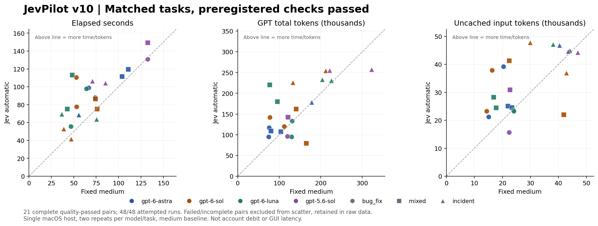

# JevPilot v10 validation — 2026-09-23

[完整中文报告](README.zh-CN.md) · [Raw runs](runs.csv) · [Paired data](pairs.csv) · [Protocol](protocol.json) · [Summary](summary.json)

**Status: all preregistered runs attempted. 48/48 attempted model tasks; 44 completed within the deadline and passed independent acceptance. 21 complete quality-passed pairs.**

For that matched subset, observed elapsed-time saving is **-27.57%**, and GPT total-token saving is **-14.61%**. Negative saving means the automatic arm used more time or tokens. These are observations from synthetic tasks on one shared macOS host, not a general product guarantee. Read the failures alongside the successful subset.

## What was tested

- Four real models: GPT-6 Astra, Sol, Luna and GPT-5.6 Sol.
- Concurrent Promise bug repair, event-ledger reconstruction, and 540-line incident analysis with contradictory and missing evidence.
- Fixed medium versus Jev automatic, identical medium starting effort, alternating arm order, two repetitions per model/task, 240-second deadline, single benchmark-model concurrency.
- 10/12 first-pass functional suites met every assertion. Evidence screening missed its prespecified efficacy target (9/12 irrelevant items excluded instead of at least 10); context handoff timed out and preserved all evidence. Independent diagnostic follow-ups are reported separately, never substituted for these failures.
- 15/15 native-engine contract scenarios passed with synthetic inference, including six model variants, manual settings, bounded recovery, resume, filtering and safe pass-through.
- Real Chrome extension and native Computer Use each executed two Jev-selected actions and verified the resulting page. Six decision attempts included two timeouts. Single-use ticket replay was rejected.
- Cached judgments, source recall, stale evidence, conflicting/revoked memory, exact-source offsets, unsafe/invented claims and required tests were checked. A duplicate-heavy filter fixture shrank bytes substantially; a separate nonrepeating log timed out and kept its original output.
- Five post-benchmark engineering integration checks passed using a copied real repair deliverable. A 45,521-byte multi-phase handoff shrank to 2,571 bytes with protected evidence intact and exact recovery; the second call reused 12 judgments without a new Jev request. This is handoff size, not native-history or measured GPT-token savings. See [engineering evidence](engineering-evidence.json).

## Important limits

The controlled benchmark disables code-mode in both arms to expose native text tool boundaries. Ordinary desktop nested code-mode outputs are **not automatically rewritten**. Direct module tests, real desktop activation, native synthetic tests and real-model performance are separate evidence levels.

The model benchmark also disables apps, sets `selectedCapabilityRoots=[]`, and prohibits accessing skills, external projects and subagents to isolate host effort routing and text-output filtering. Other modules were tested through live Jev functional fixtures, without individual GPT control arms. It is not an end-to-end comparison of all 14 modules working together, and it does not establish time/token savings for every feature.

The machine was not dedicated: normal applications and the parent conversation remained active, and early functional/browser/native checks overlapped some timed arms. No cloud-cache reset was possible. We report cached and uncached input separately. Latency excludes engine startup and offline acceptance. There is no graphical desktop wall-time, account debit, subscription-quota saving, component ablation or Windows/Linux real-desktop result here.

Reasoning tokens are already included in output tokens; cached tokens are already included in input tokens. Failed requests may have unknown remote usage. Jev tokens cannot be added to GPT tokens to infer equivalent cost. The [Chinese report](README.zh-CN.md) includes the input-only TypeSafe cost estimate and all limitations.

## Evidence and reproducibility

| Evidence | Artifact |
|---|---|
| Full model receipts, quality checks and generated deliverables | [runs.json](runs.json) |
| Read-only collection of generated source and test files | [generated-files.json](generated-files.json) |
| Feature first pass / independent diagnostics | [features.json](features.json), [followup.json](followup.json), [unique-log.json](unique-log.json) |
| Native engine / real host drivers | [native.json](native.json), [browser.json](browser.json) |
| Current ordinary task / dashboard API | [ordinary-routing.json](ordinary-routing.json), [dashboard.json](dashboard.json) |
| Installed source equality / frozen source hashes | [installed-source-match.json](installed-source-match.json), [source-integrity.json](source-integrity.json) |
| Environment / independent-oracle sensitivity | [environment.json](environment.json), [oracle.json](oracle.json) |
| Additional qualitative review of generated prose | [semantic-review.json](semantic-review.json) |
| Test fixtures and execution | [acceptance scripts](../../../scripts/acceptance) |

The plots are generated from the same CSV by Matplotlib; [SVG](paired-results.svg) and [PNG](paired-results.png) are provided. Statistical summaries use 10,000 fixed-seed cluster bootstrap draws, grouping by model/task; this small exploratory interval is not population evidence. Product code was frozen during measurement. Raw failed attempts remain included.
